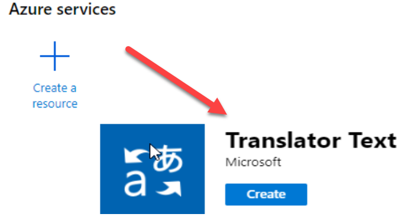
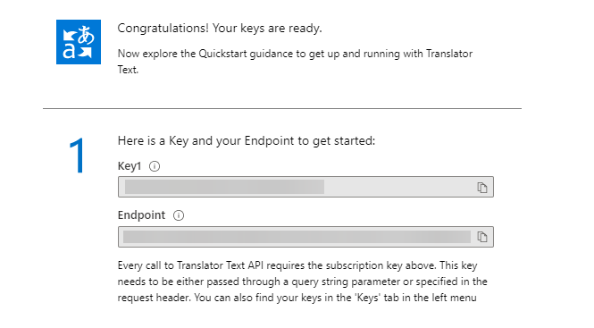
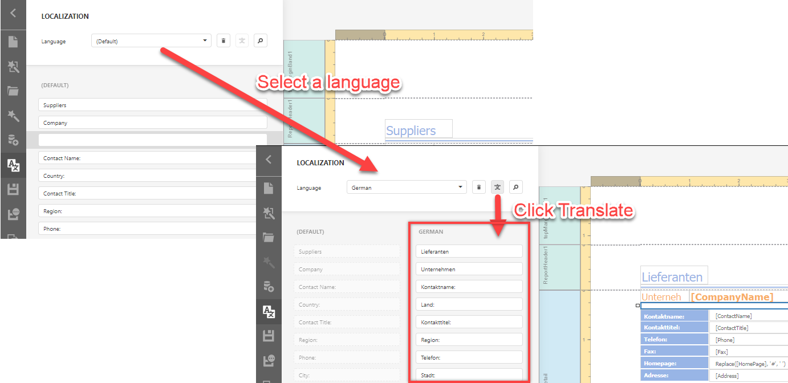

# How to Use the Microsoft Azure Translator Text API in Report Localization

This example demonstrates how to create a custom localization service that allows users to automatically translate  reports in the End-User Report Designer.

To localize a report, users enter translated texts in the End-User Report Designer's **Localization Editor**. When a custom service is registered, the Localization Editor displays a button next to the **Language** drop-down. A user can click the button to automatically translate all texts in the Localization Editor to the selected language.




The application obtains a language identifier and a list of report items whose texts should be translated, and passes them to the service. The service returns the translated texts.

You can implement a custom service as a frontend or backend custom solution and specify it as the endpoint. In this example, we use the [Microsoft Azure Translator Text API](https://azure.microsoft.com/en-us/services/cognitive-services/translator-text-api/). See also: [Translator Text API documentation](https://docs.microsoft.com/en-us/azure/cognitive-services/translator/translator-info-overview).

1. Microsoft Azure Translator Text service resource initialization.

    1.1 Create a **Translator Text** Cognitive Service resource in the Azure portal and obtain an endpoint and a key that authenticates your application. 
    
    

    Refer to the [Create a Cognitive Services resource using the Azure portal](https://docs.microsoft.com/en-us/azure/cognitive-services/cognitive-services-apis-create-account?tabs=multiservice%2Cwindows) topic for more information.       
      
    This example uses the [Translator Text API 3.0](https://docs.microsoft.com/en-us/azure/cognitive-services/translator/reference/v3-0-translate). The Translator Text API is divided into regions. This example uses the [Europe region](https://docs.microsoft.com/en-us/azure/cognitive-services/translator/reference/v3-0-reference#base-urls).


    1.2 This example targets ASP.NET Core, so the endpoint key and authentication key can be stored in the application settings file `appsettings.json`. Review the [Options pattern in ASP.NET Core](https://docs.microsoft.com/en-us/aspnet/core/fundamentals/configuration/options?view=aspnetcore-3.1) for more information.

        { 
            "TranslatorTextSubcriptionKey": "your_translate_key", 
            "TranslatorTextEndpoint": https://api-eur.cognitive.microsofttranslator.com/, 
        }         

    

2. End-User Report Designer initialization

    2.1. Call the `DevExpress.Reporting.Designer.Localization.registerTranslateService` client-side method in the End-User Report Designer initialization and specify the translation service endpoint.
    This example uses the Home/GetAzureServiceTranslate controller action as a URL to return the unique Azure Translator Text API endpoint key.
    ```
    function BeforeDesignerRender(s, e) { 
            DevExpress.Reporting.Designer.Localization.registerTranslationService ("AzureCognitiveService", { 
                   onRequest: (texts, language) => { 
                        var data = { 'Texts': texts.map(text => ({ 'Text': text })), 'Language': language }; 
                        return { 
                            type: "POST", 
                            url: '/Home/GetAzureTranslationService', 
                            dataType: "json", 
                            contentType: "application/json; charset=utf-8", 
                            processData: true, 
                            data: JSON.stringify(data), 
                            error: function (xhr) { 
                                DevExpress.ui.notify(xhr.statusText, "error", 500); 
                            } 
                        }; 
                    }, 
                    onResponse: (data) => { 
                        if (data.error && data.error.message) { 
                            DevExpress.ui.notify(data.error.message, "warning", 500); 
                            return []; 
                        } 
                        return data.map(function (item) { 
                                return item.translations[0].text 
                            });
                        } 
                    }); 
    }
    ```
   The service sends the data to translate to the server. If all the required permission are granted to the server, it sends a request to the Azure service, obtains the result and sends it back to the client

    2.2. The End-User Report Designer's Localization Editor displays all available .NET locales in the Language dropdown. However, the number of languages available in the Azure Text Translator is less than the number of supported locales in .NET. Refer to the [Language and region support for the Translator Text API](https://docs.microsoft.com/en-us/azure/cognitive-services/translator/language-support) for more information. 
    
    The application implements a custom localization service to adjust the list of languages available for translation.

    To specify the list of available languages, handle the client-side `CustomizeLocalization` event. 
    ```javascript
      function CustomizeLanguages(s, e) { 
                var supportedKeys = ["ar", "zh-Hans", "zh-Hant", "en", "fr", "de", "hi", "ja", "pt-BR", "pt-PT", "ru", "es"]; 
                var availableCultures = supportedKeys.reduce(function(result, item) { 
                    result[item] = DevExpress.Reporting.Metadata.availableCultures()[item] || item; return result;  
                    }, {})
                e.SetAvailableCultures(availableCultures); 
            } 
    ```